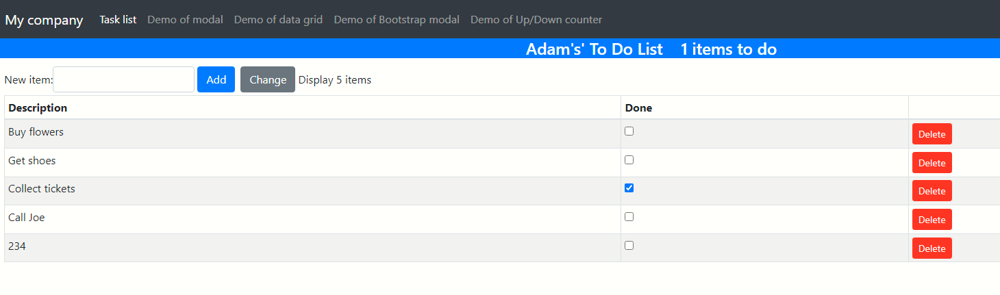
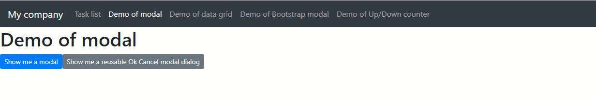
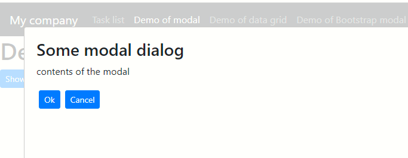
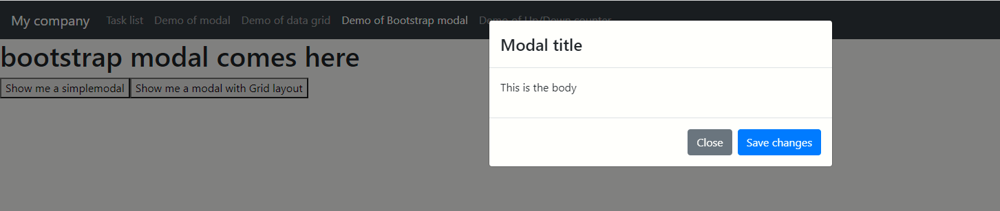
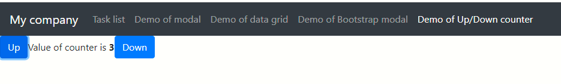

# Overview
Some experiments with React and Boostrap


# Simple Task list


# Basic modal dialog using React





# Modal dialogs using Bootstrap


# Datagrid using Material UI


# Up-down counter



# How to run?
```npm install``

```npm run start```
