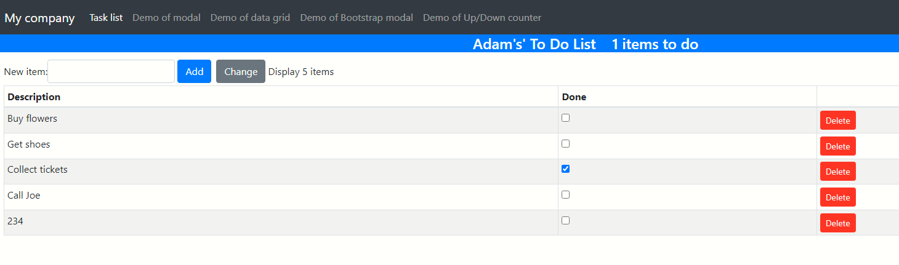
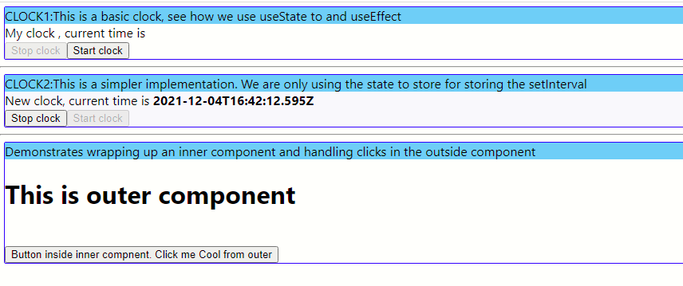
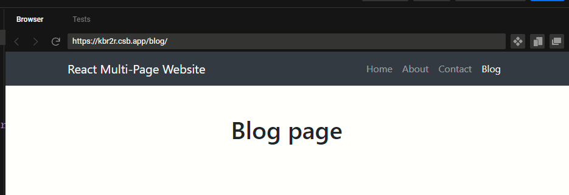

# Overview
This is a project which represents my learning and experiments with React


# BootstrapExperiments
[BootstrapExperiments](/BootStrapExperiments)



# Simple Clock and high order components

[Simple clock and high order componetns](/simple-clock-high-order)



# How to do a one-time initialization in your component?
Refer [Simple clock and high order components](/simple-clock-high-order) for usage demo

Read this StackOverFlow post
https://stackoverflow.com/questions/53120972/how-to-call-loading-function-with-react-useeffect-only-once

You are passing an `useEffect` handler with an empty array.

```
    const onloadHandler=()=>{
        console.log("CLOCK2: onLoadHandler")
    }
    rc.useEffect(onloadHandler,[]);

```

# Example of simple implmentation of Bootstrap navbar
https://codesandbox.io/s/wizardly-chaum-kbr2r?file=/src/components/Navigation.jsx

This is not mine!





# Some caveats about React router v5 and v6
The component `Switch` has been renamed to `Routes`
https://stackoverflow.com/questions/63124161/attempted-import-error-switch-is-not-exported-from-react-router-dom


# How to publish a React app to a sub-folder?
This addresses the scenario where you have React **app1** and **app2**. You want to publish them to a single static web site, but under folders `app1` and `app2`

## See how to publish a React app to a subfolder
https://blog.logrocket.com/react-router-v6/

```
    <Router basename="/simple-clock-high-order">
      <Routes>
        <Route path="/" element={ClockLayout()}>
        </Route>
      </Routes>
    </Router>
```

## Adding homepage to package.json
```
"homepage": ".",
```
This is neccessary when you are publishing the contents of `npm build` to a deep folder hierarchy in a static web site
https://stackoverflow.com/questions/43011207/using-homepage-in-package-json-without-messing-up-paths-for-localhost


## Note - if you are publishing to a github static web site
E.g. consider this URL `https://sdg002.github.io/junksite/` as your static web site on Github
Then you should have the following as the `basename` value:
```
<Router basename="/junksite/simple-clock-high-order">
```


# Running a local web server?
## The folder static uses node to run a local server
The packages `serveStatic` and `express` is used

## What is the physical root?
the folder ./static/

## What is the HTTP root?
/MyReactTutorial/static/

## How to start the static web server?
Navigate to the physical ./static/ folder and run the following command
```
node index.js
```

# How to deploy the build output of a React App?
If the react app is **MyReactApp** and the contents have been compiled to **MyReactApp\build** then copy over the contents of **MyReactApp\build** to a new folder **static\MyReactApp** 

# Next steps
Write a BAT file which will copy over contents from the individual build folders to the named subfolders under `static`

# Next steps
Modify the index.html under `\static\` so that it has some narration and links to each of the subfolders

# Next steps
Explore if wild card can be used to avoid the hard coding below
```
    <Router basename="/MyReactTutorial/static/simple-clock-high-order">
      <Routes>
        <Route path="/" element={ClockLayout()}>
        </Route>
      </Routes>
    </Router>

```
