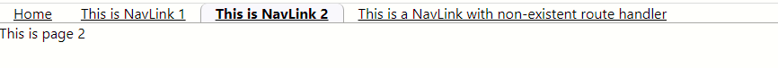

# Handling Routes and building a navbar
This is a simple React app that demonstrates how to use `Route` and `NavLink` to create a simple navigation bar

# Example



# Understanding the code
Begin with `App.js`. this is where we setup the routing logic.
```
function App() {
  let frags=document.location.pathname.split('/')
  let basename=`/${frags[1]}/${frags[2]}/router-with-navbar`

  return (
    <div>
      <Router basename={basename}>
        <div>{simplenav()}</div>
        <Routes>
          <Route path="/" element={home()}></Route>
          <Route path="/link1" element={page1()}></Route>
          <Route path="/link2" element={page2()}></Route>
          <Route path="/*" element={nonexistent()}></Route>
        </Routes>
      </Router>
    </div>
  );
}

```
The components are implemented in the `\src\components\` folder

# Structure of the navbar
This is implemented in the `simplenav.js`. We are using the `NavLink`. 
This component relies on the accompanying style sheet for rendering the links
```
const simplenav = () => {
    return (
        <nav className='bar'>
            <NavLink to='/' className='navlink'>
                Home
            </NavLink>
            
            
            
            <NavLink to='/link1'  className='navlink'>
                This is NavLink 1
            </NavLink>
            
            
            
            <NavLink to='/link2'  className='navlink'>
                This is NavLink 2
            </NavLink>
            
            
            
            <NavLink to='/somenonexistentlink'  className='navlink'>
                This is a NavLink with non-existent route handler
            </NavLink>
        </nav>
    );
};
```


# Running the app
```npm start```
followed by navigationt to
`http://localhost:3000/somefolder1/somefolder2/router-with-navbar/link2`


