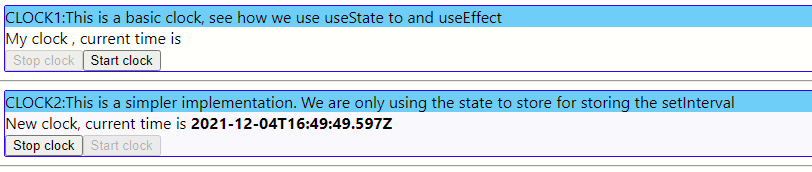
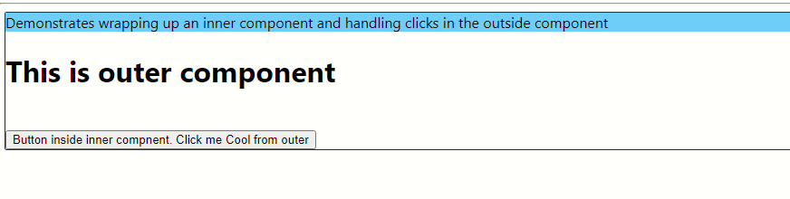

# Getting Started
Some basic experiments. 
- A simple clock which ticks every 1 second
- High order component


# Simple Clock



Demonstrates how we are using  `useState` hook and click handlers to create and destroy javascript clock


# High order component



Demonstrates how we can pass a click handler method via `props` from an outer component to the inner component. This is very useful to de-couple complexity and improve testability

# How to run?
```npm install```

```npm run start```


# Some caveats about React router v5 and v6
## The component `Switch` has been renamed to `Routes`
https://stackoverflow.com/questions/63124161/attempted-import-error-switch-is-not-exported-from-react-router-dom


## See how to publish a React app to a subfolder
https://blog.logrocket.com/react-router-v6/

```
    <Router basename="/simple-clock-high-order">
      <Routes>
        <Route path="/" element={ClockLayout()}>
        </Route>
      </Routes>
    </Router>
```

## Adding homepage to package.json
```
"homepage": ".",
```
This is neccessary when you are publishing the contents of `npm build` to a deep folder hierarchy in a static web site
https://stackoverflow.com/questions/43011207/using-homepage-in-package-json-without-messing-up-paths-for-localhost


## Note - if you are publishing to a github static web site
E.g. consider this URL `https://sdg002.github.io/junksite/` as your static web site on Github
Then you should have the following as the `basename` value:
```
<Router basename="/junksite/simple-clock-high-order">
```
